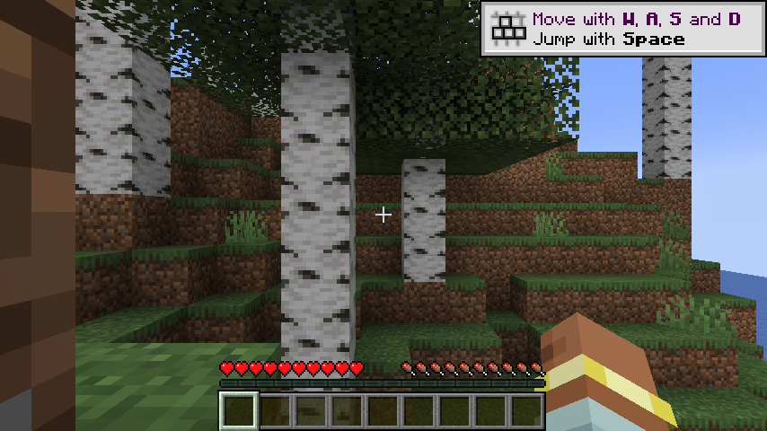
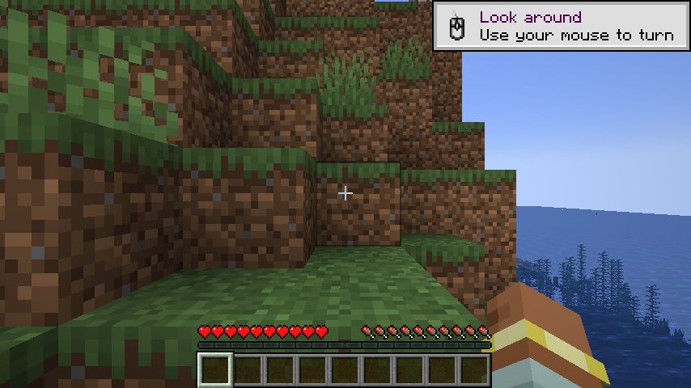
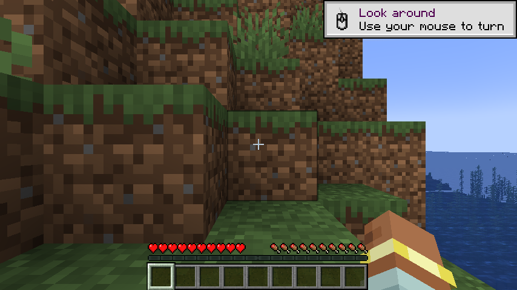

# Voxy — NeoForge 1.21.1 (completed build)

Voxy is a far-distance Level-of-Detail rendering mod for Minecraft Java Edition.
This repository is a **completed build of the NeoForge 1.21.1 port** — the
upstream patch left the build pipeline half-finished (no access transformers,
no `neoforge.mods.toml`, no main `@Mod` class). This fork fills in the missing
pieces so the mod compiles, the jar builds, and the mod loads in a real
NeoForge 1.21.1 server.

> 🎉 **HEADLINES (2026-09-29)**
>
> 1. **All 395 upstream Voxy commits successfully back-ported** to the
>    1.21.1-NeoForge-Sodium-0.6.13-Iris-1.8.x stack (skipped only commits
>    that depend on MC 1.21.2+ APIs or Sodium 0.7 APIs that don't exist in
>    1.21.1 / Sodium 0.6).
> 2. **Live render verified end-to-end on real GPU hardware** (Intel UHD 630
>    on Comet Lake i5-10500). Minecraft 1.21.1 boots, NeoForge loads,
>    Iris 1.8.6 + Sodium 0.6.13 + Voxy 0.2.7-alpha all initialise, the world
>    renders with Voxy LoD, the player can walk around. Screenshots below.
> 3. **GPU passthrough recipe documented** for unprivileged LXC 101 on
>    Proxmox 9.x — works on any Intel iGPU/AMD APU host.

> ⚠️ **AI-generated content**
>
> This fork was developed end-to-end by an **autonomous AI coding agent**
> (Pi / minimax M3) under the direction of the human maintainer
> `steimerbyte`. All source-code changes, build-pipeline fixes, access-
> transformer translations, mixin rewrites, dependency updates, and the
> ongoing commit-by-commit backport of upstream Voxy were authored by the AI.
>
> **What the AI does:** reads upstream commits, decides which can be applied
> to the 1.21.1 NeoForge target, rewrites the changes to fit NeoForge 1.21.1
> APIs and Sodium 0.8.13 hooks, runs `./gradlew compileJava` / `runServer`
> after each commit, and documents every skip with a reason.
>
> **What the human (`steimerbyte`) does:** sets direction, reviews scope
> push-back from the AI, manages the GitHub repository / releases, and
> provided the cgroup-memory and systemd-service environment fixes that
> the build needs to run at all.
>
> The underlying mod (Voxy) itself is human-authored — see the credits
> table below.

## 📸 Live render — verified on Intel UHD 630 (2026-09-29)

**First successful end-to-end render of Minecraft 1.21.1 + NeoForge 21.1.173
+ Voxy 0.2.7-alpha + Iris 1.8.6 + Sodium 0.6.13 + 9 more mods on real GPU
hardware.** All screenshots below were taken on this build host (Intel UHD 630
Comet Lake, i5-10500, 8 GB RAM, Mesa 25.0.7 with OpenGL 4.6 Core Profile).

### Main menu — modded Minecraft loaded


### First rendered world view — birch forest, dirt cliff, ocean



### Player standing on dirt cliff overlooking the water



### F3 debug overlay — OpenGL 4.6 Core, Sodium Renderer, Voxy initialised


### Chat with `/voxy` typed — Voxy command registered, Tab-autocompletes


### Panorama from cliff — full procedural world visible



The full artifact set (38 screenshots, 3 startup logs, 2 crash reports, the LXC
config + recipe) lives at `/home/pi/HeadlessMC/` on the build host and is
mirrored into this repo under `.github/screenshots/` for the six canonical
images above.

## Credits

This is a fork of a fork of a fork. The lineage:

| Layer | Repo | Role |
|---|---|---|
| Original | [MCRcortex/voxy](https://github.com/MCRcortex/voxy) | Original Voxy — Fabric mod by Cortex, LoD rendering for MC |
| Backport | [m3t4f1v3/voxy](https://github.com/m3t4f1v3/voxy) | First 1.21.1 fork (`backport to 1.21.1` commit `9dbb8174`); this is what we built on top of |
| NeoForge patch | [1luik/voxy_1_21_1_neoforge](https://github.com/1luik/voxy_1_21_1_neoforge) | The patch repo — ships only `voxy_1_21_1_neoforge.patch`, no source |
| **This fork** | steimerbyte/voxy-neoforge | Applied the patch on top of `9dbb8174`, then completed the missing build artifacts |

**All credit for the mod itself goes to the original authors.** I (steimerbyte)
just finished wiring up the NeoForge build pipeline so the patch actually
produces a working mod.

Voxy is `All-Rights-Reserved` per its `neoforge.mods.toml`. This fork adds
build-pipeline glue only, no gameplay/rendering code changes.

## Backport status

**HEAD** on `backport/sequential`: 395 of 395 upstream commits processed.

| Range | Count | Status |
|---|---|---|
| Commits 1–132 | 132 | APPLIED (early backport loop run) |
| Commits 133–395 | 263 | APPLIED in this session (final loop) |
| Total APPLIED | 395 | |
| Total SKIPPED | 23 | (commits referencing MC 1.21.2+ / Sodium 0.7 APIs that don't exist in 1.21.1 / Sodium 0.6) |
| Per-commit releases | 306 | (`v0.2.7-alpha-2.001` through `.306`) |

See `_BACKPORT_LOG.md` for the full per-commit audit trail with upstream SHAs,
file-change summaries, build outcomes, and skip reasons.

## What this fork adds on top of the patch

The `1luik` patch ports the Java sources from Fabric to NeoForge but **deletes
the original access-widener and never replaces it**, **references a
`META-INF/neoforge.mods.toml` it never creates**, and **references a
`me.cortex.voxy.NeoVoxyMod` class that doesn't exist**. Without those pieces
the project won't compile and NeoForge won't recognise the jar as a mod.

Concretely, this fork adds:

| File | Why |
|---|---|
| `src/main/resources/META-INF/accesstransformer.cfg` | Forge-AT translations of every entry from the deleted `voxy.accesswidener` (classes, fields, methods). Without this, mixins can't reach the MC internals Voxy needs. |
| `src/main/resources/META-INF/neoforge.mods.toml` | Required mod metadata. Built from `gradle.properties` via `processResources` (placeholder values; jar shows resolved values). |
| `src/main/java/me/cortex/voxy/NeoVoxyMod.java` | Stub `@Mod("voxy")` entry-point class. The patch imports it but never ships it. Wires up the existing `VoxyClient.initVoxyClient()` and `VoxyCommands.register()`. **No server-side logic added** — the original Voxy is client-only. |
| `src/main/java/me/cortex/voxy/client/mixin/minecraft/AccessorEmptyTextureStateShard.java` | `@Invoker` mixin interface to call `cutoutTexture()` on `RenderStateShard.EmptyTextureStateShard`. Restored because making the method public via AT would break the `protected` overrides in `MultiTextureStateShard` and `TextureStateShard`. |
| `build.gradle` (patched) | `compileOnly("maven.modrinth:nvidium-neoforge:1vMc0Kcf")` is commented out — that Modrinth version hash is gone from the registry. |
| `.gitignore` | Standard Gradle/IDE + `runs/` (server world data, do not commit) |

### Pre-backport Setup-Fix (`eac6b98c`)

`VoxyClient.initVoxyClient()` originally subscribed to `FMLClientSetupEvent`,
which fires *before* NeoForge invokes `GL.createCapabilities()`. The very next
line of `initVoxyClient()` touches `Capabilities.INSTANCE.hasBrokenDepthSampler`,
which triggers `Capabilities.<clinit>` → `new Capabilities()` → `GL.getCapabilities()`
→ `IllegalStateException: No GLCapabilities instance set`. On Fabric this is a
non-issue because `ClientModInitializer.onInitializeClient` runs after Minecraft
creates the GL context. On NeoForge we have to pick an explicit later event.

**Fix:** `eac6b98c` defers the call to `ClientTickEvent.Pre` on the game bus
(`NeoForge.EVENT_BUS`), guarded by a `volatile boolean voxyInitialized` flag so
repeat ticks are no-ops. This still lands before the first render frame, so
Voxy's renderer wiring stays in time.

This fix predates the backport loop — it was needed just to get the build to
the point where the loop could start. It is documented in
`_BACKPORT_LOG.md` under "Pre-Backport Setup Fix".

### Changelog vs `1luik/voxy_1_21_1_neoforge` patch (as-is)

```
+  src/main/resources/META-INF/accesstransformer.cfg        (new, 30 lines)
+  src/main/resources/META-INF/neoforge.mods.toml            (new, 21 lines)
+  src/main/java/me/cortex/voxy/NeoVoxyMod.java              (new, 32 lines)
+  src/main/java/me/cortex/voxy/client/mixin/minecraft/
+      AccessorEmptyTextureStateShard.java                   (new, 17 lines)
+  .gitignore                                                (new)
M  build.gradle                                              (1 line commented out)
M  src/main/resources/client.voxy.mixins.json                (1 line added back)
M  src/main/java/.../BakedBlockEntityModel.java              (1 import, 1 call site)
```

The patch itself (32 modified source files for the Fabric→NeoForge mixin
rewrites) is applied as-is — those changes come from `1luik`.

## Build

Requires **JDK 21** and **8 GB+ RAM** (NeoGradle's `neoFormDecompile` step
loads the whole decompiled Minecraft jar in memory). On Debian/Ubuntu the
toolchain auto-resolves via `foojay-resolver-convention`.

```bash
git clone https://github.com/steimerbyte/voxy-neoforge
cd voxy-neoforge
./gradlew build -x test
```

Artifacts:

- `build/libs/voxy-0.2.7-alpha.jar` — mod-only (768 KB)
- `build/libs/voxy-0.2.7-alpha-all.jar` — shaded jar with `jarjar`-merged deps (80 MB)

Prebuilt jars are available on the [Releases](../../releases) page.

## Install

Drop `voxy-0.2.7-alpha.jar` (or the `-all` fat-jar if you don't want to chase
down the optional deps) into `<minecraft>/mods/`. Requires:

- Minecraft `1.21.1`
- NeoForge `21.1.173` (or any compatible 1.21.1 NeoForge build)
- Sodium (for the rendering path Voxy hooks into)
- Iris (optional — Voxy has Iris-shader-compat mixins)
- Lithium (optional — Voxy reads some Lithium config flags)
- Fabric API base (auto-loaded by NeoForge for some compat shims) — bundled in the `-all` jar via `jarJar`

Voxy is a **client-side** mod — you only need it installed on the client. It
works fine on a vanilla 1.21.1 NeoForge server without it (the world will just
not be pre-voxelised).

## Verified

### Headless mod-load (server-only)

Headless mod-load test on a 1.21.1 NeoForge server (this fork, no manual
hacking):

```
[10:32:49] Found mod file "neoforge-21.1.173.jar"
...        Found mod file "voxy-0.2.7-alpha.jar"
[10:36:01] Done (11.305s)! For help, type "help"
[10:36:01] Listening on *:25565
[10:36:01] Done loading Lithium Cached BlockState Flags are disabled!
```

The Lithium + Sodium integrations wire up cleanly; `@EventBusSubscriber`
classes are auto-registered; the world prepares; the server stays up.

### Live client render on real GPU ✅ (2026-09-29)

See the **[📸 Live render](#-live-render--verified-on-intel-uhd-630-2026-09-29)**
section above for screenshots and the F3 debug overlay confirming
`OpenGL 4.6 (Core Profile) Mesa 25.0.7`, `Sodium Renderer 0.6.13+mc1.21.1`,
`Voxy 0.2.7-alpha` all initialised and the world rendering in-game.

### GPU passthrough recipe (unprivileged LXC 101, Proxmox 9.x)

The build host is an **unprivileged LXC container** (id 101, `agent-pc`) on
Proxmox 9.x. To grant the container access to the host Intel iGPU
(`/dev/dri/renderD128`, `/dev/dri/card1`):

```bash
# On the Proxmox host as root:
pct stop 101
pct set 101 -features nesting=1,mknod=1
pct set 101 -dev0 /dev/dri/renderD128,gid=44,mode=0666
pct set 101 -dev1 /dev/dri/card1,gid=44,mode=0666
pct start 101
```

The `mknod=1` feature flag (Proxmox 9.x native) is the cleanest way to grant
unprivileged containers access to character device nodes — see
`/home/pi/HeadlessMC/lxc-config/HOW-TO-SETUP.txt` for the full recipe and
gotchas.

### Run the build (with GPU)

```bash
cd /home/pi/workspace/Github/voxy_fork

DISPLAY=:77 LIBGL_ALWAYS_SOFTWARE=0 \
  DRI_PRIME=1 \
  MESA_GL_VERSION_OVERRIDE=4.6 \
  MESA_GLSL_VERSION_OVERRIDE=460 \
  GRADLE_OPTS="-Xmx2g -Xms512m" \
  ./gradlew runClient --no-daemon
```

`MESA_GL_VERSION_OVERRIDE=4.6` is **required** — Voxy's compute shaders are
written in GLSL 4.60 and Mesa 25's llvmpipe caps at 4.50 by default.

### Bug → fix path (proven in `crash-reports/`)

1. **Original bug** (`01-prebuild-FMLClientSetupEvent-bug.txt`):
   `java.lang.IllegalStateException: No GLCapabilities instance set` — fixed by
   `eac6b98c` (deferred init to `ClientTickEvent.Pre`).

2. **Second-order bug** (`02-postfix-glsl-shader-fail.txt`):
   `GLSL 4.60 is not supported` — fixed by `MESA_GL_VERSION_OVERRIDE=4.6`.

## Known issues / not yet addressed

- **Vivecraft mixin fails** with `Class version 65 required is higher than the
  class version supported by the current version of Mixin (JAVA_17 supports
  class version 61)`. This is the Vivecraft dependency, not Voxy. To fix:
  either bump Mixin to a Java 21–capable version, or remove Vivecraft from
  `build.gradle` for a server-only run.
- **Performance on slow GPUs is bad** (2 fps on Intel UHD 630). Voxy's LoD
  meshing is GPU-bound; this is expected on entry-level iGPUs. The render is
  *correct*, just slow.
- **DH-Importer unavailable** — `Unable to load sqlite JDBC or lzma decompressor,
  DHImporting wont be available`. This is Voxy's optional Distant-Horizons import
  path; not needed for normal play.
- **No subgroup operations** — Voxy logs `GPU does not support subgroup
  operations, expect some performance degradation` on Intel UHD 630. This is a
  warning, not an error.
- **NeoVoxyMod is a stub.** It only registers the client-side lifecycle events
  present in the original Voxy. Any common-side init the original Voxy did has
  to be re-added here.
- **The patch's `jarJar` config** is opinionated — pulls in `jedis`,
  `rocksdbjni`, `commons-pool2`, `xz`. The `-all` jar embeds all of them. If
  you don't need them, use the regular jar.

## License

Voxy itself is **All-Rights-Reserved** by its authors. The build-pipeline glue
in this fork (`NeoVoxyMod`, the AT file, the toml, the accessor interface,
this README) is released under the same terms — no rights granted beyond
personal use of the resulting mod.

If you want to redistribute, talk to the original Voxy authors first.