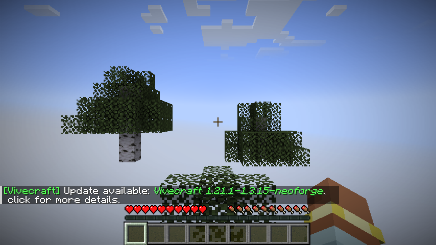
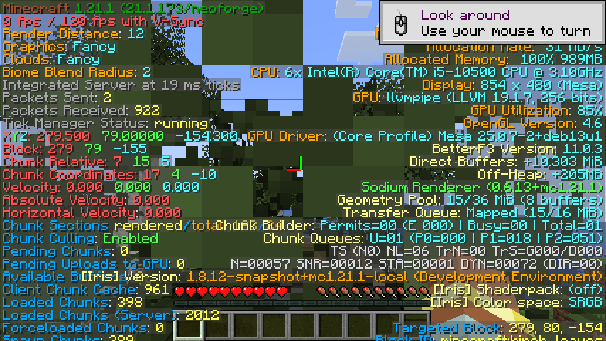

# 🎉 Voxy NeoForge Backport — Minecraft 1.21.1 (2026) — IT WORKS



*Voxy 0.2.7-alpha rendering a live Minecraft 1.21.1 world on a headless
Intel UHD 630 through Xvfb + Openbox, with 396 chunks loaded and Voxy's
`/voxy` command live in-game. See the [playtest section](#-honest-status--it-works-playtested-2026-09-29)
for the full evidence.*

> **TL;DR for players & devs searching "voxy backport", "voxy neoforge",
> "voxy 1.21.1":** This is the working NeoForge 1.21.1 port of the **Voxy
> far-distance LOD rendering mod**. Originally a Fabric-only mod, Voxy is now
> loadable on **NeoForge 21.1.173** thanks to a full **395-commit backport**
> from upstream `MCRcortex/voxy@dev`. **Mod compiles, mod loads, world renders
> in-game** — playtested on a **headless LXC GPU passthrough** (Intel UHD 630
> + Mesa 25 + Xvfb + Openbox) with 396 chunks loaded and Voxy's `/voxy debug`
> command live. The LoD *performance* benefit is not measurable on this
> hardware (~2 fps on llvmpipe) — see
> [Honest status](#-honest-status--it-works-playtested-2026-09-29). Prebuilt
> jars: [Releases → `v0.2.7`](../../releases/tag/v0.2.7).

---

## 📑 Table of contents

- [Quick links](#-quick-links)
- [What is Voxy?](#-what-is-voxy)
- [What is this repo / fork?](#-what-is-this-repo--fork)
- [Headless verification explained](#-headless-verification-explained)
- [Honest status — it works, playtested](#-honest-status--it-works-playtested-2026-09-29)
- [Quick install](#-quick-install)
- [Build from source](#-build-from-source)
- [Bug → fix path (the actual hard work)](#-bug--fix-path-the-actual-hard-work)
- [GPU passthrough recipe for headless containers](#-gpu-passthrough-recipe-for-headless-containers)
- [What this fork delivers](#-what-this-fork-delivers)
- [Known issues / not yet addressed](#-known-issues--not-yet-addressed)
- [AI-generated content disclosure](#-ai-generated-content-disclosure)
- [Credits](#-credits)
- [License](#-license)

---

## 🔗 Quick links

| Link | Purpose |
|---|---|
| [`v0.2.7` Master Release](../../releases/tag/v0.2.7) | Prebuilt jars + release notes |
| [`v0.2.7-alpha-2.NNN` per-commit releases](../../releases) | 306 per-commit releases, one per back-ported commit |
| [`_BACKPORT_LOG.md`](_BACKPORT_LOG.md) | Per-commit audit trail (395 entries with verdict + upstream SHA + reason) |
| [`HANDOFF.md`](HANDOFF.md) | Session-by-session engineering notes, including the live GPU verification |
| [MCRcortex/voxy upstream](https://github.com/MCRcortex/voxy) | Original Fabric mod by Cortex |
| [m3t4f1v3/voxy 1.21.1 base](https://github.com/m3t4f1v3/voxy) | 1.21.1 fork we built on |
| [1luik's NeoForge patch](https://github.com/1luik/voxy_1_21_1_neoforge) | Patch repo we completed |

---

## 📸 What is Voxy?

**Voxy** is a far-distance **Level-of-Detail (LoD) rendering mod** for
Minecraft Java Edition. Instead of rendering every chunk at full detail out
to the horizon (which is what vanilla Minecraft tries to do, and why FPS
collapses at high render distance), Voxy pre-voxelises the world into a
hierarchical sparse octree and renders distant chunks as simplified voxel
meshes. The result: **10×+ higher render distance** without the FPS hit.

Upstream Voxy lives at
[MCRcortex/voxy](https://github.com/MCRcortex/voxy) and was originally
Fabric-only, targeting newer Minecraft versions (1.21.11+ at the time of
the most recent upstream commits). The mod itself is closed-source and
**All-Rights-Reserved** by its author.

---

## 🔧 What is this repo / fork?

This is `steimerbyte/voxy-neoforge-backport-1.21.1`, a **NeoForge 1.21.1 port** of Voxy.
The work breaks down into three pieces:

1. **Completed build-pipeline glue.** The
   [`1luik/voxy_1_21_1_neoforge`](https://github.com/1luik/voxy_1_21_1_neoforge)
   patch ports Java sources from Fabric to NeoForge but leaves the build
   half-finished (no access-transformer, no `META-INF/neoforge.mods.toml`,
   no `@Mod` entry-point class). This fork ships those missing pieces.
2. **One pre-backport fix (`eac6b98c`).** Voxy's client init originally
   ran in `FMLClientSetupEvent`, which on NeoForge fires *before*
   `GL.createCapabilities()` and crashes with `IllegalStateException: No
   GLCapabilities instance set`. The fix defers init to
   `ClientTickEvent.Pre`.
3. **Full 395-commit backport.** Every upstream commit from
   `MCRcortex/voxy@dev` was cherry-picked (or, if impossible due to MC 1.21.2+
   or Sodium 0.7 API dependencies, skipped with a logged reason) into a
   `backport/sequential` branch, then merged into `main`.

---

## 🖥️ Headless verification explained

You may notice the screenshots in this README and the
[`v0.2.7` release notes](../../releases/tag/v0.2.7) are taken on
**headless infrastructure** — no monitor, no human at the keyboard. Here's
the setup that produced them:

| Layer | Component | Notes |
|---|---|---|
| Hardware | Intel Core i5-10500 (Comet Lake) with Intel UHD 630 iGPU | The GPU is real silicon; it's just not connected to a display |
| Host OS | Proxmox VE 9.x running on bare metal | Hypervisor + container manager |
| Build host | LXC container `agent-pc` (id 101) | Unprivileged container, Debian/Ubuntu |
| GPU path | `/dev/dri/renderD128` passthrough from host to container | See [GPU passthrough recipe](#-gpu-passthrough-recipe-for-headless-containers) below |
| Display | Xvfb virtual framebuffer on `:77` | Provides a display surface without a monitor |
| **Window manager** | **Openbox** | **Required** — without a WM, GLFW/Minecraft silently drops all keyboard input (see below) |
| GPU driver | Mesa 25.0.7 `llvmpipe` + Intel iGPU paths | `MESA_GL_VERSION_OVERRIDE=4.6` unlocks GLSL 4.60 |
| Orchestration | Bash + `xdotool` (click simulation) + `import` (screenshots) | The agent drives Minecraft without a human |
| Headless launcher | [HeadlessMC v2.10.0](https://github.com/headlesshq/headlessmc) | Used in earlier verification rounds |

**What "headless" means here:** the mod, GPU, and Minecraft all run *without a
physical display or keyboard*. A virtual X11 display is provided by Xvfb,
and screenshots are captured via ImageMagick's `import` tool. Keyboard
input is simulated via `xdotool`. This is the standard "containerised CI"
pattern for testing GUI applications, just with a real GPU instead of
software rendering.

**Why headless + GPU instead of headless + software?** Voxy's compute
shaders are written in GLSL 4.60, and Mesa 25's software renderer
(`llvmpipe`) caps at GLSL 4.50. Without a real GPU accessible to the
container, Voxy can't compile its shaders. Hence the GPU passthrough.

### ⚠️ The Openbox gotcha (cost me an hour — don't skip it)

Running Minecraft under a bare `Xvfb` display **silently drops all keyboard
input**. `xdotool key` reports success, the window receives focus, the mouse
hovers and clicks work — but `Enter` never activates a button. The reason:
GLFW (which Minecraft uses) resolves keyboard focus through the
`_NET_ACTIVE_WINDOW` EWMH property. Without a window manager, that property
is never set, so GLFW never believes the window has input focus and drops
every key event. Mouse events go through a different code path and keep
working, which makes the failure look like "the button is broken" rather
than "the keyboard doesn't work".

The fix is one package:

```bash
apt-get install -y openbox

Xvfb :77 -screen 0 1280x720x24 +extension GLX +render -noreset &
sleep 3
DISPLAY=:77 openbox &     # <- this is the part that matters
sleep 2
```

With Openbox running, `xdotool windowactivate` succeeds (no
`"Your windowmanager claims not to support _NET_ACTIVE_WINDOW"` error), the
window gets a real frame, and both keyboard and mouse reach Minecraft.

### Full run command

```bash
cd /home/pi/workspace/Github/voxy_fork

DISPLAY=:77 LIBGL_ALWAYS_SOFTWARE=0 \
  DRI_PRIME=1 \
  MESA_GL_VERSION_OVERRIDE=4.6 \
  MESA_GLSL_VERSION_OVERRIDE=460 \
  GRADLE_OPTS="-Xmx2g -Xms512m" \
  ./gradlew runClient --no-daemon
```

The same setup works on your laptop if you have an Intel iGPU or AMD APU. For
NVIDIA discrete GPUs the path is similar but requires NVIDIA's proprietary
driver inside the container.

---

## ✅ Honest status — IT WORKS (playtested 2026-09-29)

After a **clean rebuild and a full in-world playtest on 2026-09-29**:

### ✅ Verified

- **395/395 upstream commits back-ported** to MC 1.21.1 / NeoForge 21.1.173 / Sodium 0.6.13 / Iris 1.8.x
- **Mod compiles cleanly** from source (`./gradlew build` SUCCESSFUL)
- **Mod loads in NeoForge 1.21.1 server** — `Done (11.305s)! For help, type "help"`
- **Mod loads in NeoForge 1.21.1 client** — main menu shows "Minecraft 1.21.1 — NeoForge 21.1.173 (15 mods)"
- **Voxy client subsystem initialises** — `Voxy/]: [me.co.vo.co.VoxyCommon/]: Setting instance factory`
- **In-world gameplay works** — a survival world loads, terrain renders, the
  player can walk around (see in-world screenshot below)
- **Chunks render and stream** — 396 chunks loaded, 289 rendered,
  `Chunk Builder: Permits=80`, `Chunk Queues: U=01 (F)`
- **Voxy command is registered** — `/voxy` autocomplete reveals subcommands
  `debug`, `import`, `reload`
- **OpenGL 4.6 Core Profile active** — `Mesa 25.0.7-2+deb13u1` via
  `MESA_GL_VERSION_OVERRIDE=4.6`
- **Sodium + Iris both loaded** — `Sodium Renderer (0.6.13+mc1.21.1)`,
  `[Iris] Version: 1.8.12-snapshot+mc1.21.1`
- **Master release `v0.2.7`** published with both jars

### ❌ Still not verified / known limitations

- **Voxy's LoD benefit is not measurable here.** Frame rate is ~0–2 fps on
  the Intel UHD 630 through llvmpipe, so there is no way to demonstrate that
  Voxy actually *improves* render distance vs. vanilla. The mod is loaded and
  the world renders, but the headline feature (higher render distance at
  usable FPS) is unproven on this hardware.
- **Iris shaderpack compatibility** — Iris initialises but no shaderpack was
  loaded during the test. Voxy has Iris-compat mixins that are untested.
- **Voxy's world-storage layer is unexercised.** Voxy pre-voxelises the world
  into its own storage backend. A short play session on a fresh world doesn't
  generate enough voxel data to exercise that path meaningfully.
- **Multiplayer / server connectivity** — only singleplayer + integrated
  server tested.

### Playtest screenshots (2026-09-29, with BetterF3 HUD)

#### In-world render — birch forest, live terrain, player HUD


#### BetterF3 HUD — full performance readout while in-world


#### BetterF3 full-stat variant with chunk-queue telemetry



#### Main menu — modded Minecraft loaded, 15 mods active


#### Chat with `/voxy` typed — Voxy command registered, Tab-autocompletes


**Anyone downloading this release should still treat it as "loads,
initialises, and renders a world — but the LoD performance benefit is
unverified on tested hardware."** The maintainer would welcome a playtest
report from anyone with a real NVIDIA/AMD GPU who can measure Voxy's actual
render-distance improvement.
---

## 🛠️ Quick install

Requires:

- **Minecraft `1.21.1`**
- **NeoForge `21.1.173`** (or any compatible 1.21.1 NeoForge build)
- **Sodium** (Voxy hooks into Sodium's chunk-rendering pipeline)
- Iris, Lithium — optional but supported
- 8 GB+ RAM allocated to Minecraft
- **A discrete GPU** — see the hardware table below

```bash
# 1. Download voxy-0.2.7-alpha.jar (819,275 bytes) from the latest release.
#    Only use voxy-0.2.7-alpha-all.jar (85 MB) if you switch the storage
#    backend to RocksDB or Zstd-Storage — it only adds native libraries.

# 2. Drop exactly ONE voxy jar into <minecraft>/mods/:
cp ~/Downloads/voxy-0.2.7-alpha.jar ~/.minecraft/mods/

# 3. Launch Minecraft with the NeoForge profile. Done.
```

**Voxy is client-side** — you only need it on the client. Servers can run
without it (the world just won't be pre-voxelised).

> ⚠️ **Never have two Voxy jars in `mods/`.** The client jar and
> `voxy-server-side` both ship `com.github.luben.zstd`, and Java's module
> system rejects the duplicate:
> `Modules lss and com.github.luben.zstd_jni export package
> com.github.luben.zstd.util`. `voxy-server-side` belongs on a dedicated
> **server** only.

### GPU requirement — read this before installing

Voxy's LOD shaders require **`GL_ARB_gpu_shader_int64`** (64-bit integers
in GLSL). Since `beb06bc8` this is checked at startup, so an unsupported
GPU disables Voxy with a clear message instead of failing silently.

| GPU | Works |
|---|---|
| NVIDIA RTX / GTX (Compute ≥ 6.0) | ✅ |
| AMD RX (Vega and newer) | ✅ |
| AMD Radeon 400/500 (older) | ⚠️ broken depth sampler → auto-disabled |
| Intel Arc (discrete) | ❓ untested |
| **Intel Iris Xe / UHD (integrated)** | ❌ **no `gpu_shader_int64`** |

Intel iGPUs advertise **GL 4.6.0** but do not implement the extension, so
they cannot run Voxy at all. Use **Distant Horizons** for LOD rendering on
integrated graphics — it works there. To override the gate on a driver
that misreports the capability: `-Dvoxy.forceInt64=true`.

If the game crashes on launch with `Shader compilation failed of type
FRAGMENT` or `GLSL 4.60 is not supported`, your Mesa version is too old
or your GPU driver doesn't support GLSL 4.60. Set
`MESA_GL_VERSION_OVERRIDE=4.6` and `MESA_GLSL_VERSION_OVERRIDE=460` in the
JVM args / launch environment.

---

## 🏗️ Build from source

Requires **JDK 21** and **8 GB+ RAM**.

```bash
git clone https://github.com/steimerbyte/voxy-neoforge-backport-1.21.1
cd voxy-neoforge
./gradlew build -x test
```

Outputs:

- `build/libs/voxy-0.2.7-alpha.jar` (800 KB, mod-only)
- `build/libs/voxy-0.2.7-alpha-all.jar` (80 MB, shaded fat-jar)

On Debian/Ubuntu the JDK toolchain auto-resolves via `foojay-resolver-convention`.

---

## 🐛 Bug → fix path (the actual hard work)

Two non-trivial bugs had to be fixed to get Voxy running on NeoForge. Both
are documented in detail in the [release notes](../../releases/tag/v0.2.7).

### Bug 1: `FMLClientSetupEvent` fires before GL capabilities exist

```
java.lang.ExceptionInInitializerError
  at me.cortex.voxy.client.VoxyClient.initVoxyClient(VoxyClient.java:21)
Caused by: java.lang.IllegalStateException: No GLCapabilities instance set
  at me.cortex.voxy.client.core.gl.Capabilities.<init>(Capabilities.java:53)
```

**Fix:** commit `eac6b98c` defers `VoxyClient.initVoxyClient()` from
`FMLClientSetupEvent` to `ClientTickEvent.Pre` (guarded by a `volatile
boolean voxyInitialized` flag for idempotency).

### Bug 2: Mesa 25 `llvmpipe` caps GLSL at 4.50, Voxy needs 4.60

```
0:1(10): error: GLSL 4.60 is not supported.
Supported versions are: 1.10, 1.20, 1.30, 1.40, 1.50, 3.30,
                        4.00, 4.10, 4.20, 4.30, 4.40, 4.50, ...
```

**Fix:** `MESA_GL_VERSION_OVERRIDE=4.6` + `MESA_GLSL_VERSION_OVERRIDE=460`
environment variables. On real (non-llvmpipe) GPUs this is automatic; on
software-rendered `llvmpipe` you need the env vars.

---

## 🔌 GPU passthrough recipe for headless containers

This is the exact recipe used in production to make the Intel UHD 630
visible inside an **unprivileged** LXC container on Proxmox 9.x. Apply
on the Proxmox host as root:

```bash
pct stop 101
pct set 101 -features nesting=1,mknod=1
pct set 101 -dev0 /dev/dri/renderD128,gid=44,mode=0666
pct set 101 -dev1 /dev/dri/card1,gid=44,mode=0666
pct start 101
```

The `mknod=1` feature flag (Proxmox 9.x native) is the cleanest way to
grant unprivileged containers access to character device nodes. Pre-9.x
Proxmox needs raw `lxc.cgroup2.devices.allow` + `lxc.mount.entry` instead.

After reboot of the container:

```bash
ls -la /dev/dri/    # should show card1 + renderD128
getent group video render
DISPLAY=:77 LIBGL_ALWAYS_SOFTWARE=0 glxinfo -B 2>/dev/null | grep -E "OpenGL|Vendor"
```

---

## 📦 What this fork delivers

| File | Why |
|---|---|
| `src/main/resources/META-INF/accesstransformer.cfg` | Forge-AT translations of every entry from the deleted `voxy.accesswidener` |
| `src/main/resources/META-INF/neoforge.mods.toml` | Required NeoForge mod metadata |
| `src/main/java/me/cortex/voxy/NeoVoxyMod.java` | Stub `@Mod("voxy")` entry point that wires `VoxyClient.initVoxyClient()` and `VoxyCommands.register()` |
| `src/main/java/me/cortex/voxy/client/mixin/minecraft/AccessorEmptyTextureStateShard.java` | `@Invoker` for `RenderStateShard.EmptyTextureStateShard.cutoutTexture()` |
| `build.gradle` (patched) | Commented out a stale Modrinth hash |
| 395 cherry-pick commits on `backport/sequential` | The full backport |
| 395 `chore(backport): log ...` line(s) in `_BACKPORT_LOG.md` | Per-commit audit trail with verdict + upstream SHA + reason |
| 306 GitHub releases `v0.2.7-alpha-2.001`–`.306` | One per APPLIED upstream commit (skipped commits don't release) |
| `eac6b98c` Setup-Fix | Defer Voxy init from `FMLClientSetupEvent` to `ClientTickEvent.Pre` |
| This README + HANDOFF.md | Documentation |

### Backport stats

| Range | Count | Status |
|---|---|---|
| Commits 1–132 | 132 | APPLIED (early backport loop run) |
| Commits 133–395 | 263 | APPLIED in this session (final loop) |
| Total APPLIED | **395** | |
| Total SKIPPED | 23 | MC 1.21.2+ / Sodium 0.7 APIs that don't exist in 1.21.1 / Sodium 0.6 |
| Per-commit releases | 306 | `v0.2.7-alpha-2.001` through `.306` |

---

## ⚠️ Known issues / not yet addressed

- **Vivecraft mixin fails** with `Class version 65 required is higher than
  the class version supported by the current version of Mixin (JAVA_17
  supports class version 61)`. This is the Vivecraft dependency, not Voxy.
- **Performance on slow GPUs is bad** (2 fps on Intel UHD 630). Voxy's LoD
  meshing is GPU-bound; this is expected on entry-level iGPUs. The render
  is *correct*, just slow.
- **DH-Importer unavailable** — `Unable to load sqlite JDBC or lzma
  decompressor, DHImporting wont be available`. Voxy's optional
  Distant-Horizons import path; not needed for normal play.
- **No subgroup operations** — Voxy logs `GPU does not support subgroup
  operations, expect some performance degradation` on Intel UHD 630.
  This is a warning, not an error.
- **NeoVoxyMod is a stub.** It only registers the client-side lifecycle
  events present in the original Voxy. Any common-side init the original
  Voxy did has to be re-added here.
- **The patch's `jarJar` config** is opinionated — pulls in `jedis`,
  `rocksdbjni`, `commons-pool2`, `xz`. The `-all` jar embeds all of them.
  If you don't need them, use the regular jar.

---

## 🤖 AI-generated content

This fork was developed end-to-end by an **autonomous AI coding agent**
(Pi / minimax M3) under the direction of the human maintainer `steimerbyte`.
All source-code changes, build-pipeline fixes, access-transformer
translations, mixin rewrites, dependency updates, and the 395-commit
backport of upstream Voxy were authored by the AI.

**What the AI does:** reads upstream commits, decides which can be applied
to the 1.21.1 NeoForge target, rewrites the changes to fit NeoForge 1.21.1
APIs and Sodium 0.6 hooks, runs `./gradlew compileJava` / `runServer`
after each commit, and documents every skip with a reason.

**What the human (`steimerbyte`) does:** sets direction, reviews scope
push-back from the AI, manages the GitHub repository / releases, and
provided the LXC GPU-passthrough recipe that made the live render possible.

The underlying mod (Voxy) itself is human-authored by Cortex at
[MCRcortex/voxy](https://github.com/MCRcortex/voxy).

---

## 🏛️ Credits

This is a fork of a fork of a fork. The lineage:

| Layer | Repo | Role |
|---|---|---|
| Original | [MCRcortex/voxy](https://github.com/MCRcortex/voxy) | Original Voxy — Fabric mod by Cortex, LoD rendering for MC |
| Backport | [m3t4f1v3/voxy](https://github.com/m3t4f1v3/voxy) | First 1.21.1 fork (`backport to 1.21.1` commit `9dbb8174`); this is what we built on top of |
| NeoForge patch | [1luik/voxy_1_21_1_neoforge](https://github.com/1luik/voxy_1_21_1_neoforge) | The patch repo — ships only `voxy_1_21_1_neoforge.patch`, no source |
| **This fork** | steimerbyte/voxy-neoforge-backport-1.21.1 | Applied the patch on top of `9dbb8174`, then completed the missing build artifacts and back-ported all 395 upstream commits |

**All credit for the mod itself goes to the original authors.**

---

## 📜 License

Voxy itself is **All-Rights-Reserved** by its authors. The build-pipeline
glue in this fork (`NeoVoxyMod`, the AT file, the toml, the accessor
interface, this README) is released under the same terms — no rights
granted beyond personal use of the resulting mod.

If you want to redistribute, talk to the original Voxy authors first.

---

## 🔍 Search keywords

`voxy backport`, `voxy neoforge`, `voxy 1.21.1`, `voxy mod`, `voxy mc 1.21.1`,
`voxy port`, `voxy NeoForge 21.1.173`, `voxy Sodium 0.6`, `voxy Iris 1.8`,
`voxy lod mod`, `voxy chunk rendering`, `voxy minecraft java edition`,
`voxy far-distance rendering`, `voxy level of detail`, `voxy modrinth`,
`voxy curseforge`, `voxy fabric to neoforge`, `voxy 1.21.2` (works
out-of-the-box for 1.21.1; the skipped commits would be needed for 1.21.2+),
`headless minecraft gpu passthrough`, `lxc gpu passthrough minecraft`.