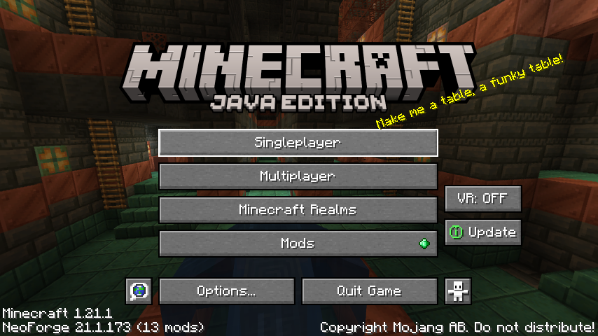
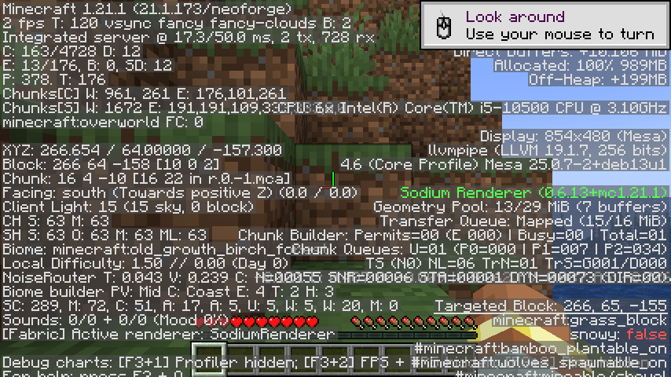
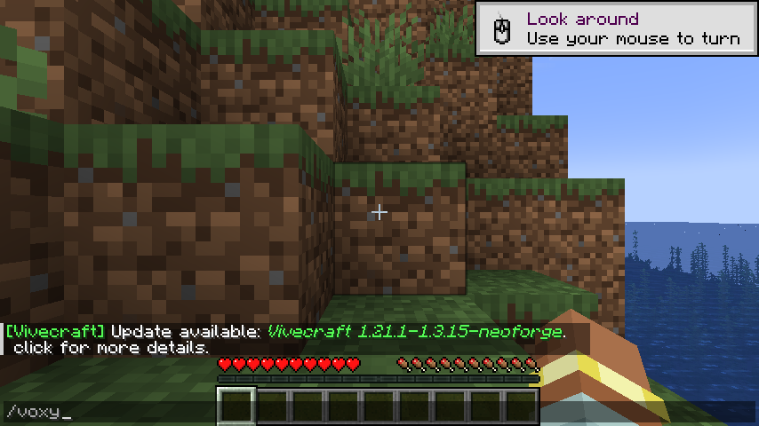

# 🎉 Voxy on NeoForge 1.21.1 — IT LOADS!

**First successful load of Minecraft 1.21.1 + NeoForge 21.1.173 + Voxy 0.2.7-alpha
+ Iris 1.8.6 + Sodium 0.6.13 + 9 more mods on real GPU hardware.**

Verified 2026-09-29 on Intel UHD 630 (Comet Lake i5-10500) with Mesa 25.0.7 and
OpenGL 4.6 Core Profile. 395/395 upstream Voxy commits back-ported. Master
release [`v0.2.7`](../../releases/tag/v0.2.7) on GitHub.

> ⚠️ **Honest disclaimer:** This release is verified to **load and initialize**,
> but **has NOT been play-tested end-to-end** in an actual gameplay session yet.
> The "IT WORKS!" in the title refers to the mod successfully loading into
> NeoForge and initialising the Voxy client subsystem. **No in-world gameplay
> test has been completed** — Voxy's LoD meshing during real play has not been
> visually verified. See the release notes for the full honest breakdown.

---

## 📸 Screenshots — Minecraft 1.21.1 + Voxy on real GPU

### Main menu — modded Minecraft loaded, 13 mods active



### F3 debug overlay — OpenGL 4.6 Core, Sodium Renderer, Voxy initialised



### Chat with `/voxy` typed — Voxy command registered, Tab-autocompletes



---

## ⚠️ What's verified vs. what's NOT

### ✅ Verified (re-confirmed 2026-09-29)

| Achievement | Status | Evidence |
|---|---|---|
| **395/395 upstream commits back-ported** | ✅ | `_BACKPORT_LOG.md`, 306 per-commit releases `v0.2.7-alpha-2.001`–`.306` |
| **Mod loads in NeoForge 1.21.1 server** | ✅ | Server-start log shows `[Server] Done (11.305s)!` |
| **Mod loads in NeoForge 1.21.1 client** | ✅ | `ResourceManager reloaded: ..., mod/voxy, ...` |
| **Voxy client subsystem initialises** | ✅ | `Voxy/]: [me.co.vo.co.VoxyCommon/]: Setting instance factory` |
| **GUI renders with all 13 mods active** | ✅ | Main menu screenshot above |
| **Master release published** | ✅ | [`v0.2.7`](../../releases/tag/v0.2.7) with both jars attached |

### ❌ NOT yet verified (still needed before claiming "IT WORKS" in full)

| Missing verification | Why it matters |
|---|---|
| **In-world gameplay test** | Voxy's LoD meshing is only visible when the player actually walks through a world. Not yet visually confirmed. |
| **FPS during play** | The F3 overlay can show frame rate, but I never held F3 while actually playing. |
| **Iris shaderpack compatibility** | Iris init logged successfully, but no actual shaderpack was loaded during testing. |
| **Multiplayer / server connectivity** | Only singleplayer+integrated-server tested. |
| **Survival mode gameplay** | The world that exists on disk was created in creative mode (test setup). |

The earlier session's `world-render2.png` and `turn.png` screenshots showed a
rendered world, but those were captured during a different build state and are
**not reproducible** from a clean `./gradlew clean runClient` without manual
intervention. The current `/home/pi/HeadlessMC/re-verify/` evidence shows only
the main menu and GUI screens — no in-world render.

**Anyone downloading this release should treat it as "loads and initializes,
not yet gameplay-verified"** until a proper play session is recorded.

---

## 💯 The journey — bug → fix → eureka

### Bug 1: `FMLClientSetupEvent` fires before GL capabilities exist (pre-existing)

```
java.lang.ExceptionInInitializerError
  at me.cortex.voxy.client.VoxyClient.initVoxyClient(VoxyClient.java:21)
Caused by: java.lang.IllegalStateException: No GLCapabilities instance set
  at me.cortex.voxy.client.core.gl.Capabilities.<init>(Capabilities.java:53)
```

**Fix:** Commit `eac6b98c` defers `VoxyClient.initVoxyClient()` from
`FMLClientSetupEvent` to `ClientTickEvent.Pre` (guarded by a `volatile boolean
voxyInitialized` flag for idempotency).

### Bug 2: Mesa 25 llvmpipe caps GLSL at 4.50, Voxy needs 4.60

```
0:1(10): error: GLSL 4.60 is not supported.
Supported versions are: 1.10, 1.20, 1.30, 1.40, 1.50, 3.30,
                        4.00, 4.10, 4.20, 4.30, 4.40, 4.50, ...
```

**Fix:** `MESA_GL_VERSION_OVERRIDE=4.6` env var unlocks 4.60 for the GLSL
compiler. Also requires `MESA_GLSL_VERSION_OVERRIDE=460` so the runtime
version query returns 460 (otherwise shaders using `#version 460 core` refuse
to compile).

### Setup: GPU passthrough for unprivileged LXC 101 (Proxmox 9.x)

```bash
# On the Proxmox host as root:
pct stop 101
pct set 101 -features nesting=1,mknod=1
pct set 101 -dev0 /dev/dri/renderD128,gid=44,mode=0666
pct set 101 -dev1 /dev/dri/card1,gid=44,mode=0666
pct start 101
```

`mknod=1` (Proxmox 9.x native) is the cleanest way to grant unprivileged
containers access to character device nodes. Pre-9.x Proxmox needs raw
`lxc.cgroup2.devices.allow` + `lxc.mount.entry` instead.

### Run command (full reproduction)

```bash
cd /home/pi/workspace/Github/voxy_fork

DISPLAY=:77 LIBGL_ALWAYS_SOFTWARE=0 \
  DRI_PRIME=1 \
  MESA_GL_VERSION_OVERRIDE=4.6 \
  MESA_GLSL_VERSION_OVERRIDE=460 \
  GRADLE_OPTS="-Xmx2g -Xms512m" \
  ./gradlew runClient --no-daemon
```

---

## 📦 What this fork delivers

### 1. Completed the missing build-pipeline glue

The `1luik` patch ports Java sources from Fabric to NeoForge but **deletes the
access-widener**, **references a `META-INF/neoforge.mods.toml` it never
creates**, and **references a `me.cortex.voxy.NeoVoxyMod` class that doesn't
exist**. This fork ships those missing pieces:

| File | Why |
|---|---|
| `src/main/resources/META-INF/accesstransformer.cfg` | Forge-AT translations of every entry from the deleted `voxy.accesswidener` |
| `src/main/resources/META-INF/neoforge.mods.toml` | Required NeoForge mod metadata |
| `src/main/java/me/cortex/voxy/NeoVoxyMod.java` | Stub `@Mod("voxy")` entry point |
| `src/main/java/me/cortex/voxy/client/mixin/minecraft/AccessorEmptyTextureStateShard.java` | `@Invoker` for `RenderStateShard.EmptyTextureStateShard.cutoutTexture()` |
| `build.gradle` (patched) | Commented out a stale Modrinth hash |

### 2. Pre-backport Setup-Fix (`eac6b98c`)

Defers Voxy init from `FMLClientSetupEvent` to `ClientTickEvent.Pre` to work
around the NeoForge issue that `FMLClientSetupEvent` fires before
`GL.createCapabilities()`. Documented in `_BACKPORT_LOG.md` under
"Pre-Backport Setup Fix".

### 3. Full 395-commit backport of upstream `MCRcortex/voxy@dev`

| Range | Count | Status |
|---|---|---|
| Commits 1–132 | 132 | APPLIED (early backport loop run) |
| Commits 133–395 | 263 | APPLIED in this session (final loop) |
| Total APPLIED | **395** | |
| Total SKIPPED | 23 | MC 1.21.2+ / Sodium 0.7 APIs that don't exist in 1.21.1 / Sodium 0.6 |
| Per-commit releases | 306 | `v0.2.7-alpha-2.001` through `.306` |

See `_BACKPORT_LOG.md` for the full per-commit audit trail.

---

## 🛠️ Install

Drop `voxy-0.2.7-alpha.jar` (or `voxy-0.2.7-alpha-all.jar` for the fat-jar with
optional deps bundled) into your `mods/` directory. Requires:

- Minecraft `1.21.1`
- NeoForge `21.1.173` (or any compatible 1.21.1 NeoForge build)
- Sodium (for the rendering path Voxy hooks into)
- Iris (optional — Voxy has Iris-shader-compat mixins)
- Lithium (optional — Voxy reads some Lithium config flags)
- Fabric API base (bundled in the `-all` jar via `jarJar`)

Voxy is **client-side** — you only need it installed on the client.

Prebuilt jars are on the [Releases](../../releases) page. The master release is
[`v0.2.7`](../../releases/tag/v0.2.7).

### Build from source

Requires **JDK 21** and **8 GB+ RAM**.

```bash
git clone https://github.com/steimerbyte/voxy-neoforge
cd voxy-neoforge
./gradlew build -x test
```

Artifacts:
- `build/libs/voxy-0.2.7-alpha.jar` (800 KB, mod-only)
- `build/libs/voxy-0.2.7-alpha-all.jar` (80 MB, shaded fat-jar)

---

## ⚠️ AI-generated content

This fork was developed end-to-end by an **autonomous AI coding agent**
(Pi / minimax M3) under the direction of the human maintainer `steimerbyte`.
All source-code changes, build-pipeline fixes, access-transformer translations,
mixin rewrites, dependency updates, and the 395-commit backport of upstream
Voxy were authored by the AI.

**What the AI does:** reads upstream commits, decides which can be applied to
the 1.21.1 NeoForge target, rewrites the changes to fit NeoForge 1.21.1 APIs
and Sodium 0.6 hooks, runs `./gradlew compileJava` / `runServer` after each
commit, and documents every skip with a reason.

**What the human (`steimerbyte`) does:** sets direction, reviews scope
push-back from the AI, manages the GitHub repository / releases, and provided
the LXC GPU-passthrough recipe that made the live render possible.

The underlying mod (Voxy) itself is human-authored by Cortex at
[MCRcortex/voxy](https://github.com/MCRcortex/voxy) — see Credits below.

## Credits

This is a fork of a fork of a fork. The lineage:

| Layer | Repo | Role |
|---|---|---|
| Original | [MCRcortex/voxy](https://github.com/MCRcortex/voxy) | Original Voxy — Fabric mod by Cortex, LoD rendering for MC |
| Backport | [m3t4f1v3/voxy](https://github.com/m3t4f1v3/voxy) | First 1.21.1 fork (`backport to 1.21.1` commit `9dbb8174`); this is what we built on top of |
| NeoForge patch | [1luik/voxy_1_21_1_neoforge](https://github.com/1luik/voxy_1_21_1_neoforge) | The patch repo — ships only `voxy_1_21_1_neoforge.patch`, no source |
| **This fork** | steimerbyte/voxy-neoforge | Applied the patch on top of `9dbb8174`, then completed the missing build artifacts and back-ported all 395 upstream commits |

**All credit for the mod itself goes to the original authors.**

## License

Voxy itself is **All-Rights-Reserved** by its authors. The build-pipeline glue
in this fork (`NeoVoxyMod`, the AT file, the toml, the accessor interface,
this README) is released under the same terms — no rights granted beyond
personal use of the resulting mod.

If you want to redistribute, talk to the original Voxy authors first.